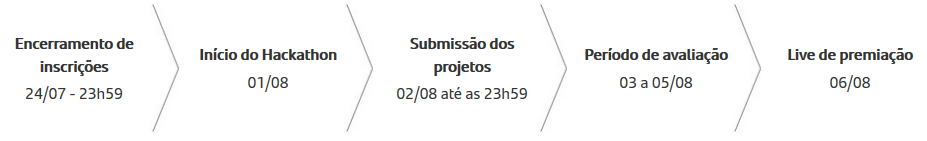
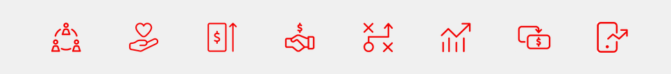

# Hackathon Santander Data Challenge

O Hackathon Santander Data Challenge é uma maratona de dados com o objetivo de criar soluções inovadoras para desafios reais. O evento quer reunir cientistas e engenheiros de dados, e outros profissionais relacionados à essa área. 

 

  <a href="#desafio">Desafio</a> •
  <a href="#material">Material</a> •
  <a href="#projeto">Projeto</a> •
  <a href="#ferramentas">Ferramentas</a> •
  <a href="#integrantes">Integrantes</a> •
  <a href="#licença">Licença</a>

## Desafio

#### Contextualização

Pequenas e médias empresas brasileiras sabem que inovar é imprescindível para seu funcionamento e permanência no mercado. Isso é o que mostra o resultado da pesquisa do Comitê Inovação nas Pequenas e Médias Empresas (PME) da Associação Nacional de Pesquisa, Desenvolvimento e Engenharia das Empresas Inovadoras (Anpei).

Com o início da pandemia, as preferências sobre o consumo de determinados serviços e produtos mudou. O número de proprietários de pequenas e médias empresas fechando as portas é grande e ainda vai aumentar.

Uma inovação bem-sucedida pode representar melhor posicionamento no mercado (ou em alguns casos, a liderança) e até mesmo a sobrevivência de uma empresa.

#### Problema

<h4><bold>Como auxiliar as puequenas e médias emoresas a se reerguerem dos impactos negativos da crise econômica gerada pela pandemia do Covid-19 ?</bold></h4>
 

<ul>
<li>Como auxiliar as pequenas e médias empresas na convergência digital/novos processos e tecnologias para apoio/novas experiências de consumo/novas soluções e-commerce?</li>
<li>Há atividades, produtos ou serviços que possam ser aprimorados?</li>
<li>O setor está necessitando de alguma inovação que possa ser desenvolvida?</li>
<li>O setor está desatualizado em relação às tecnologias hoje existentes e você pode modernizá-lo?</li>
<li>Como é possível que pequenos e médio negócios continuem de portas abertas?</li>
<li>Como se adaptar à nova realidade? Como estruturar e ampliar os negócios com apoio da tecnologia?</li>
<li>Como auxiliar os negócios na convergência digital?</li>
<li>Como ou quais novos processos e tecnologias podem aproximar empresas e governos para apoiar pequenos e médios negócios?</li>
<li>Como estimular o comércio?</li>
<li>Como criar novas experiências de consumo?</li>
<li>Como criar soluções de e-commerce e pagamento on-line para pequenos e médios empreendedores?</li>
<li>Com tantos desafios, também estamos certos que existem inúmeras oportunidades escondidas nesses dados todos, e o Data Challenge é a chance de você e seu time mostrarem as suas habilidades de explorar e extrair informações dos dados, e ajudar a nossa sociedade a construir um futuro melhor! Então, o que podemos fazer juntos hoje?</li>
</ul>

## Material

Veja todo o material produzido para este desafio nos seguintes links:

- [Vídeo Pitch](https://www.youtube.com/watch?v=ccsShi_OQes&feature=youtu.be)
- [Vídeo Demo](https://www.youtube.com/watch?v=5OKWfBvLui0&feature=youtu.be)
- [Apresentação em PDF](https://docs.google.com/presentation/d/1m8kq7SwjirGGPz30uzie9KGO2NRp0tqN9tXSz8Hkm38/edit#slide=id.p)
- [Site utilizando a Solução](https://douglasjim.github.io/hackthonSantander/)

## Projeto

O Portal Phoenix oferece para o usuário um serviço de previsão e estimativa, com base em dados disponibilizados por empresas de transporte e geolocalização, de trafego de pessoas em determinadas regiões.

<pA>ssim, o MEI terá como atender as demandas do mercado, preparando-se com antecedência para alocar mais ou menos recursos conforme as estimativas fornecidas, evitando percas e prejuízos de estoque e produtos perecíveis.

## Ferramentas

<ul>
<li>Trello</li>
<li>IBM Watson Studio</li>
<li>Miro</li>
<li>GitHub</li>
<li>Sony Vegas</li>
<li>Power Bi</li>
<li>Python</li>
<li>HTML</li>
<li>CSS</li>
<li>Java Script</li>
<li>Bootstrap</li>
</ul>

## Integrantes

<table>
<tr>
    <td> Douglas Santos</td>
    <td> Gustavo Dias</td>
    <td> João Assis</td>
    <td> Karol Cardoso</td>
    <td> Rene Jerez</td>
  </tr>
  <tr>
    <td><a href="https://www.linkedin.com/in/douglas-santos-sousa/" target="_blank">Linkedin</a></td>
    <td><a href="https://www.linkedin.com/in/gustavopereiradias/" target="_blank">Linkedin</a></td>
    <td><a href="https://www.linkedin.com/in/jvitorassis/" target="_blank">Linkedin</a></td>
    <td><a href="https://www.linkedin.com/in/karoline-cardoso-50787a133/" target="_blank">Linkedin</a></td>
    <td><a href="https://www.linkedin.com/in/renejerez/" target="_blank">Linkedin</a></td>
  </tr>
  </table>

## Licença

Esse projeto está sob a licença MIT. Veja o arquivo [LICENSE](LICENSE.md) para mais detalhes.
